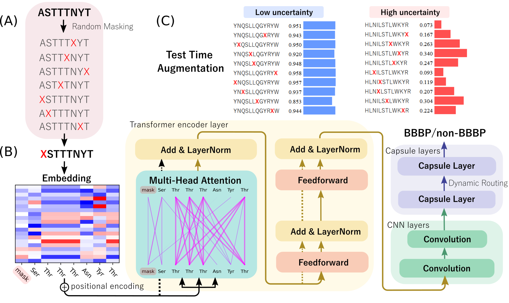
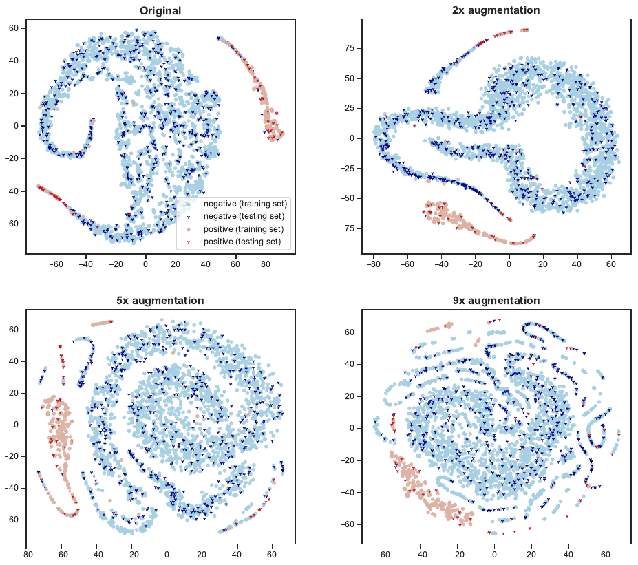

# DeepB<sup>3</sup>P<sup>3</sup>: masked peptide transformer for low-data peptide drug discovery
<p align="center">
  
</p>

### Installation
See requirements.txt.

### Datasets

### Masking peptides for small data challenge
The size of drug discovery datasets can be extremely limited due to the high cost of the experiments ([1](https://pubs.acs.org/doi/10.1021/acscentsci.6b00367),[2](https://pubs.acs.org/doi/10.1021/acs.chemrev.3c00189)). However, the training of modern neural networks typically requires large-scale high-quality data. In this paper, we introduce 'masked peptide' that can significantly overcome this issue (Fig. (A)).

Unlike other data augmentation methods, our masking peptide technique does not involve any substitution, insertion, or deletion, but it can significantly change the latent distribution, as follows.
<p align="center">
  
</p>

### Training
```bash
python DeepB3P3.py \
    --train_path 'bbbp/d3_train_a1x8.txt' \
    --test_path 'bbbp/d3_test_a1x8.txt' \
    --result_path 'temp/d1_test.pred.txt' \
    --log_path 'temp/d1_test.txt.log' \
    --max_length 75 \
    --conv1_kernel 10 \
    --conv2_kernel 10 \
    --regCLASS --LR 0.001 --EVALUATE_ALL --NUM_EPOCHS 50
```
Or experiment with multiple magnitudes of data augmentation:
```bash 
mkdir collect
bash run.sh
```
### Analysis

### Reference

